

<h1 align="center">Merlin - Alternative Role Playing Game</h1>

Auxiliar de jogadores de RPG interpretativo

 desenvolvido e testado no PyCharm 2021.2 / Python 3.8

 <a href="#objetivo">Objetivo</a> •
 <a href="#comandos">Comandos</a> • 
 <a href="#requisitos">Requisitos</a> • 
 <a href="#autor">Autor</a>

### Objetivo
---
<a>Este projeto tem como objetivo auxiliar jogadores de RPG interpretativo, aumentando a imersão através de recursos do discord</a>

Inicialmente baseado no jogo tibia.com, porém pode utilizar a base que achar melhor

* Salva a ficha do usuário, podendo consultar a qualquer momento
* Inventario do personagem
* Equipamentos do personagem
* Combate com monstros
* Entre outros recursos

### Requisitos
---

É necessário a criação das tags "aguardando aprovação", "verificado", "cadastrado" e "em recuperação"

* aguardando aprovação: tag dada automaticamente ao jogador quando entra no grupo
* verificado: dado manualmente por um administrador, após aprovar o membro a utilizar os canais
* cadastrado: tag dada automaticamente após criação do cadastro, necessário para utilizar os comandos do bot
* em recuperação: dado automaticamente após jogador estar com 0 de vida

 Criação de um chat específico para utilizar os comandos e respostas do bot, configurado em const/ANUNCIO_ID
<h1 align="center">
  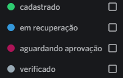
</h1>

### Comandos
---
* !cadastrar Nome, Raca, Classe, Idade, link_foto -> Realizar cadastro da sua ficha
* !consultar cadastro -> Verificar cadastro atual
* !deletar cadastro -> Deleta totalmente seu cadastro
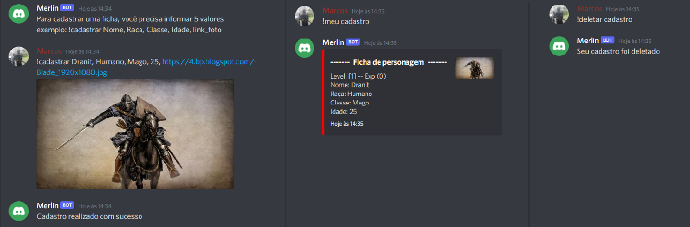

* !meu status -> Consultar status do personagem
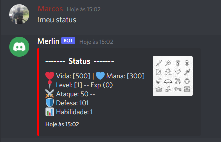

* !gerar "Nome" -> Gera um monstro conforme nome selecionado, baseado na lista de monstros do arquivo json/monstros.json
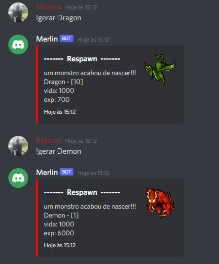

* !atacar "Nome" -> ataca um monstro que esteja disponível no jogo, irá girar os dados, 1/20, 10+ sucesso | 10- falha
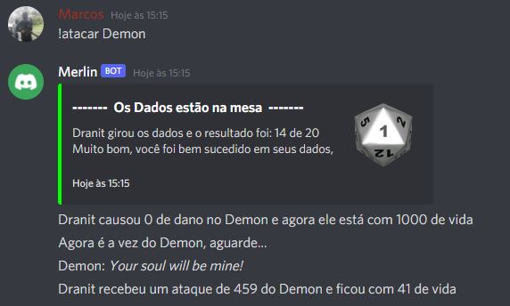

* caso perca, seu ataque é cancelado e passa a vez ao atacado
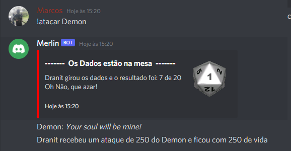

* caso sua vida chegue a 0, é enviado para enfermaria, a partir deste momento jogador fica inápto a jogar
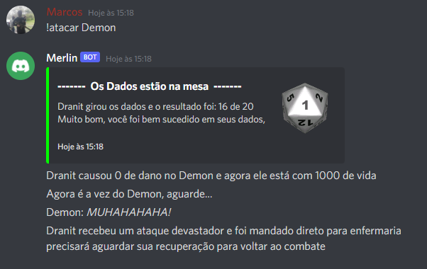

* caso mate a criatura, irá receber o xp e o loot ficará disponível para pegar
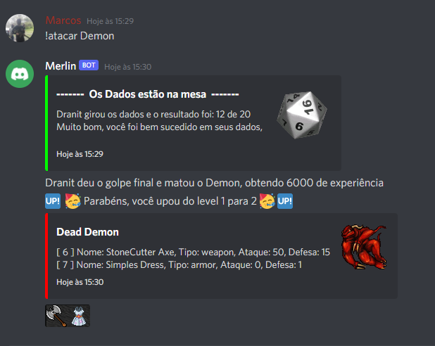

* !pegar ID -> para pegar um item e por no inventário, basta informar o ID do item
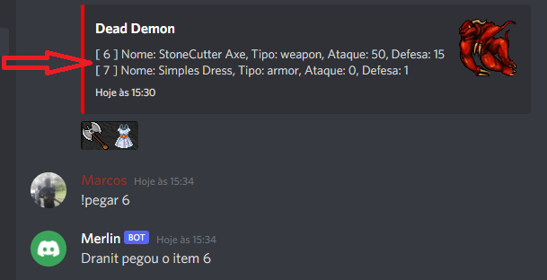

* !loot disponivel -> consultar a lista de itens ainda disponível no chão
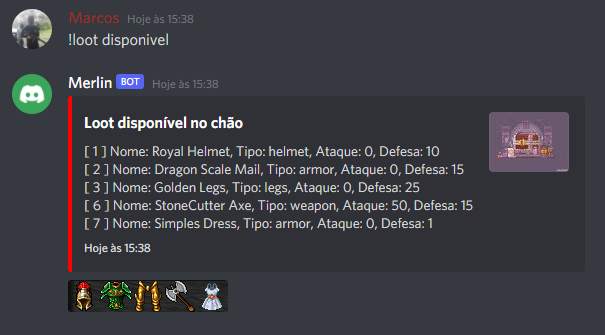

* !meu inventario -> consultar os itens coletados em seu inventário
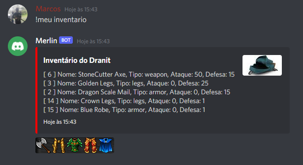

* !meu set -> consultar os itens no set do personagem
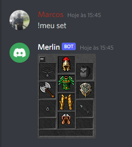

* !equipar ID -> para trocar seu equipamento, basta informar o ID do item que está em seu inventário
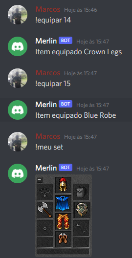

### Autor
---

<b>Marcos Pacheco</b>

Contato:

discord: Marcos#9999

